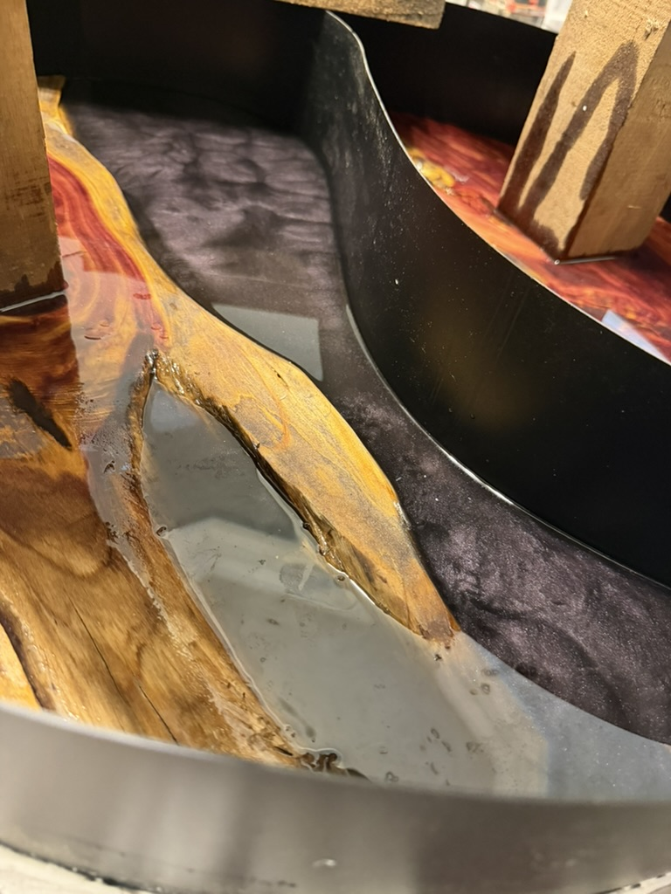
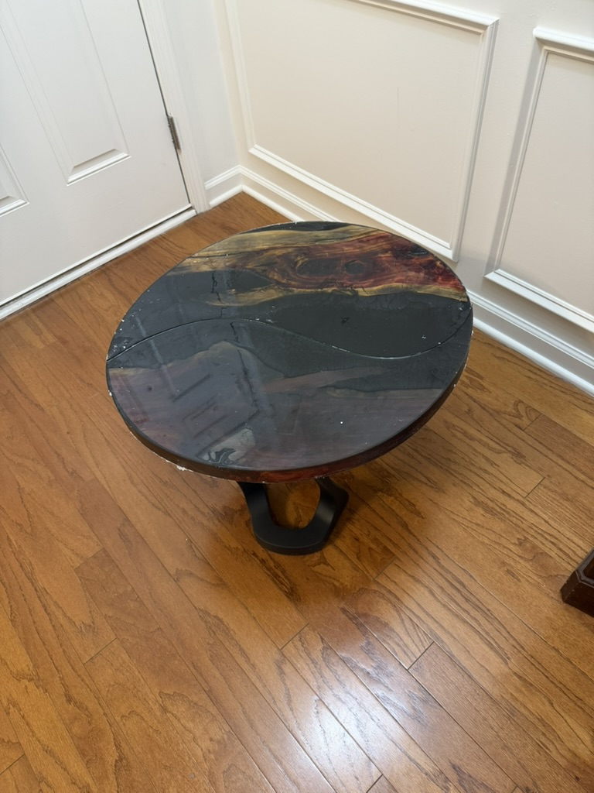
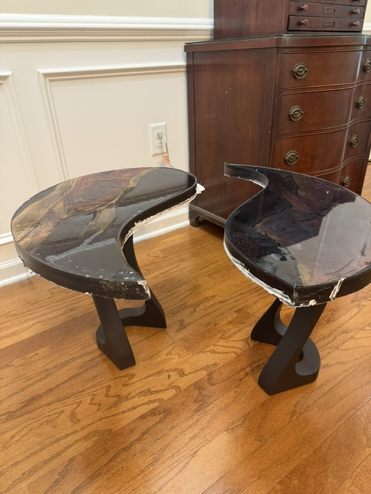

## Barn Wood

A couple of weeks ago a friend reached out to me and mentioned that they manage a property with a barn on it, and that the barn had some old wood in it. They asked if I might be interested in taking a look to see if there was anything I could use.

As if I'm going to turn down free wood! When I got there, I found that the majority of it was simply left over construction lumber, which I wasn't interested in taking. But tucked back among the spider webs and creepy-crawlies there were a couple of pieces of what I assumed was cedar. I of course took those!

## Design phase: An idea!

You can see from the chalk lines that I was originally considering making 2 distinct end-tables out of them. But then I went looking for legs. My go-to for legs is [FlowyLine Design](https://www.flowyline.com/), so I went browsing. What I found amongst their gallery was an idea that I just _had_ to build:

![Two live edge wood end tables are positioned together on light beige carpet so their curved inner edges form a full circle. Each tabletop sits on a matte black sculptural metal base with looping lines, and the wood surfaces show rich brown grain and natural markings. The tables are staged in a modern living room with a gray sofa, a tall green houseplant, and a small side table in the background. The tone is elegant and inventive, highlighting a design where two separate pieces combine into one shape.](./images/design-idea.jpeg)

I could not hit "Add to cart" fast enough on those [legs](https://flowyline.com/products/metal-bench-legs-117-uzar-16h)!

The design is simple, but the idea of two pieces that can be used separately or together is really a stand-out.

## Starting the build

The first thing to do was to see how I would lay out these pieces to achieve the design, and prep the wood. I had to lay them out, then cut them into a single circle. That's not as easy as I thought.

I used a simple technique to tracing the circle -- you find the enter-point, then, using a length of string and a piece of chalk, you trace your circle. The problem here was that this was not a single piece of wood! I had to lay them on the table, and mess around with them for a long time until I could get things laid out to maximize the use of the wood, while eliminating the straight edges (which would not look great in the midst of a circle)

![Two cedar slabs rest on a wooden workbench after rough cutting, arranged as matching curved halves with their inner live edges facing each other to suggest a nearly complete circle with a narrow center gap. The left slab has knot rich heartwood and bark remnants, while the right slab shows long purple and tan grain streaks. Workshop tools around them include a yellow power tool, a router bit set, a tape roll, and a metal straightedge, indicating active measuring and shaping. The wider environment is a busy shop workspace, and the tone feels focused and experimental.](./images/rough-out.jpeg)

When the legs arrived, I did a quick test to make sure that they would fit, and that the design would work. It was a relief to see that it did!

![Two partially finished live edge tabletop halves are balanced on black sculptural metal legs for a test fit, standing on a medium brown hardwood floor. The wood tops have uneven natural edges and light pink, tan, and cream grain, with a visible gap between the pieces where they would meet as a circle. Behind them are a white paneled wall with an electrical outlet and a dark wooden dresser at right, placing the setup in an indoor room rather than a shop. The tone feels encouraging, showing a successful early mockup of the final design.](./images/rough-legs.jpeg)

Exactly what I was looking for!

## Building a mold

Since this was a round table, and it was going to be split down the middle, the mold was going to be a bit more involved than anything I'd done before. Square molds, or center-pours, are a lot easier to manage.

I went with some flexible vinyl garden edging because it was smooth on both sides and extremely flexible.

Rather than describing the entire process, here is a time-lapse of me creating the mold from start to finish:

As you can see, I used caulk to hold the mold in place, and to stop the epoxy from leaking out when I poured (more on this later. Hint: It didn't go well). Creating the dividing line was but once I used my heat-gun to get the plastic to relax, it went fairly smoothly.

## On to the epoxy part

The first thing to do when prepping for an epoxy pour is to pick the color. I asked some of my [Instagram followers](https://www.instagram.com/grainforge/) for their thoughts, and the overwhelming response was to go with a black epoxy. I had been leaning towards red, but who am I to argue with my followers?

I did go with black, sort of, but for this table, I wanted to add a bit of depth to the epoxy, so I also added some red, blue, and gray mica powders to the mix. By my calculations I would need a little over a gallon of deep-set epoxy for this pour.With irregular pours like this, it can be hard to calculate the *exact* amount you'll need, so I tend to err on the side of too much, rather than too little. The last thing I want is to run out of epoxy mid-pour, and have to stop and mix up more, which can lead to color inconsistencies.

## Mistakes were made

So, remember when I talked about using caulk to seal the mold? Yeah, that didn't work out all that well. Not because it wasn't the right way to go, but because I did a terrible job with the caulk, and then didn't let it dry long enough. I had a lot of leaks, and I had to stop the pour several times to clean up the mess and re-seal the mold. It was a nightmare.

Yeah, that did **not** go as planned. I had also forgotten that, you know, wood floats. It's why we made boats out of it. So then I had to quick weigh down the slabs to keep them completely submerged. Once I got the flow of epoxy staunched, I decided that I would just have to do a second pour later and let it go.

## I'm not mad about the results though

Despite the leakage, and having to do a second pour the next day, I think the final epoxy color came out near-perfect. From most angles, it just looks black, but as you move around, you can see the depth from the mica powders.

I let it sit for about 3 days before I un-molded it though I probably should have let it cure longer. Sometimes I just don't have all the patience that I should. Luckily, nothing bad happened as I removed it from the mold (other than me getting covered in wet caulk). The lawn-edging was absolutely the right call, as it just popped right off without sticking at all! I did have to use a bit of percussive encouragement to get the 2 halves to separate but that wasn't really a surprise.

## So far so good!

Once I had it all un-molded and (mostly) cleaned up I decided to see how the final table might look and I am happier with it than you can imagine!

It looks like a single table, just as I had planned, but the two halves separate into distinct tables.

Now, on to the finishing process! I have to sand everything down, polish the epoxy, and then apply the finish. Before I do that, though, I think I'll use a 1/2" roundover bit on both the top and bottom to give the entire edge a nice rounded finish. Obviously I won't do that along the middle where they join, but having the outside circumference rounded will make the split more dramatic.

Stay tuned as I'll update this post as I go through the finishing process!